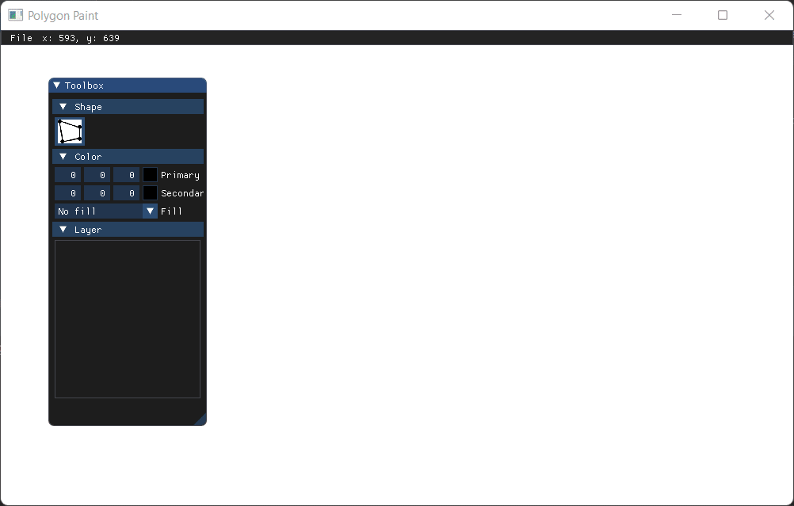
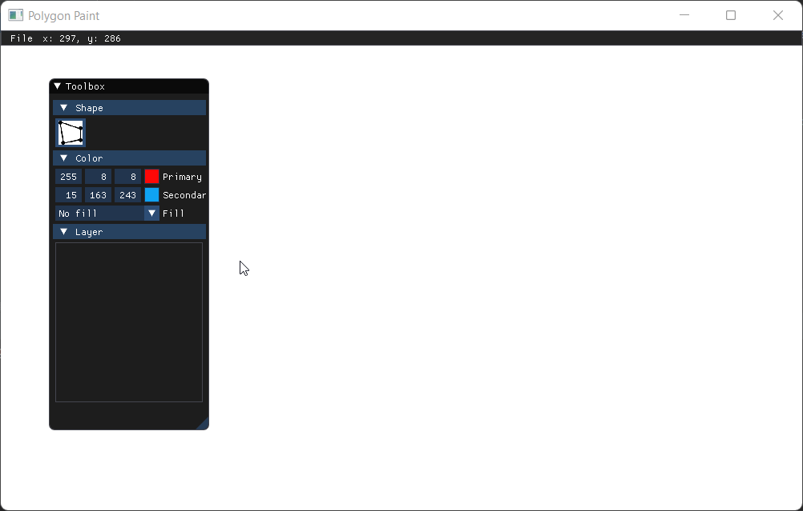
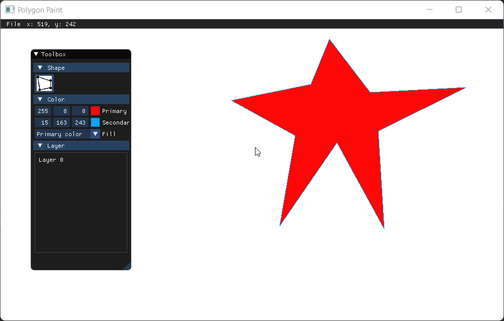
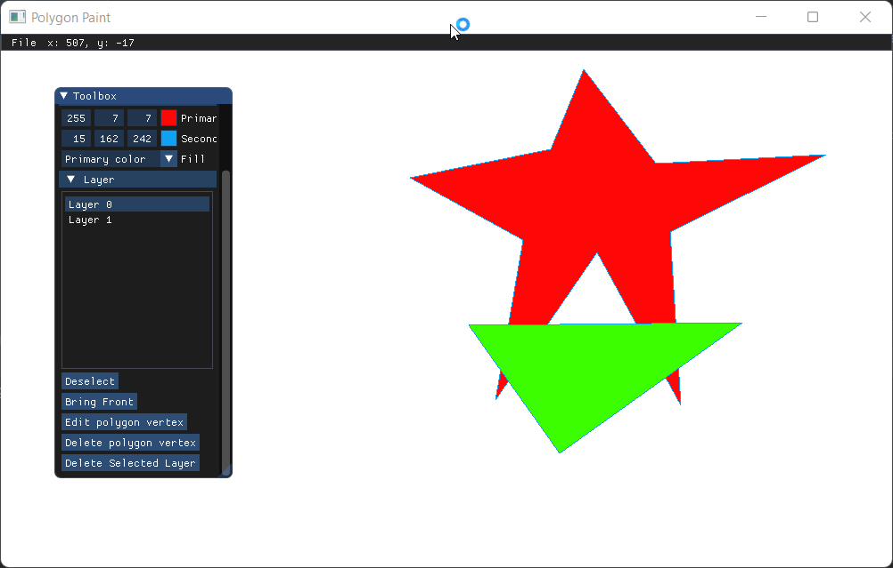
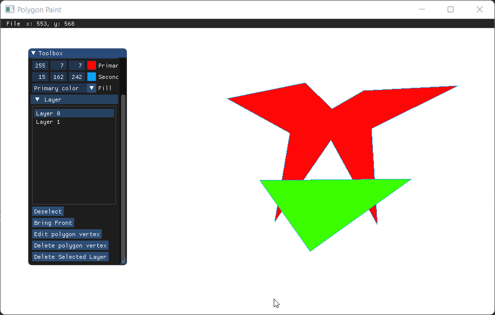
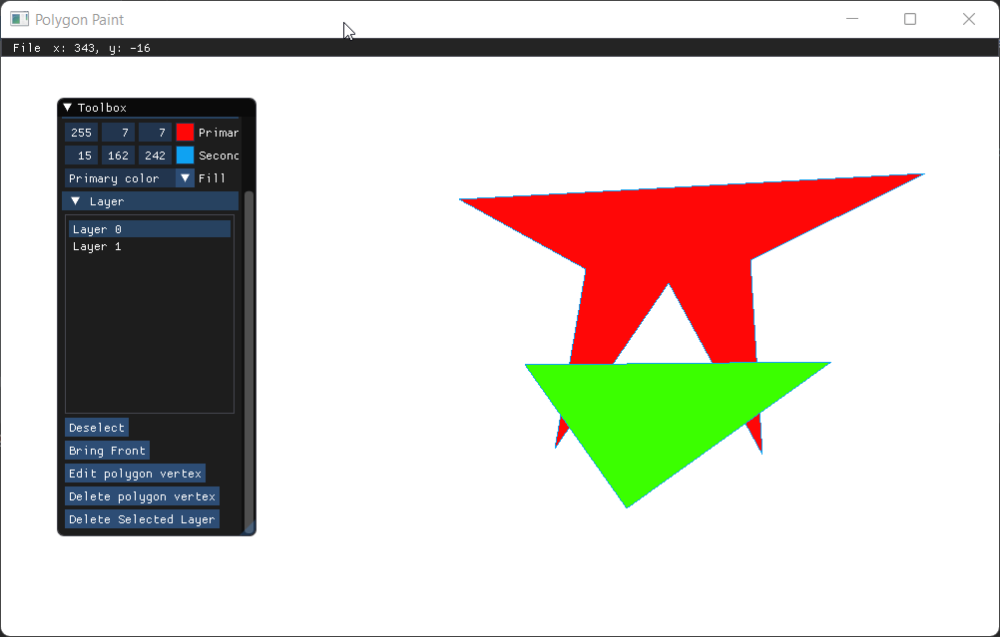

# Polygon Paint

This repository is dedicated for my Computer Graphics and Animation (CIT207) course project

Project reports: https://docs.google.com/document/d/1WZWw11JhMAVE9G6SSHbBWBBgWB-6_KUbMHDX9-uUyFo/edit?usp=sharing

## Task Detail

Create an application that allows the user to draw polygons (filled/hollow) on a screen. The application should be able to do the following:

- Draw a polygon on the screen. The user can choose to draw a hollow or filled polygon.
    - The user can draw multiple polygons; the program must be able to store the data of multiple polygons.
- Delete a polygon.
- Toggle the filled/hollow properties of a polygon.
- Change the color of a polygon.
- Set the priority of a polygon (front/behind).
- Edit/delete a point of a polygon on the screen.
- Save/load data of polygons to/from a file.
- Bonus points for user friendliness. Negative points for extreme user unfriendliness.

https://drive.google.com/open?id=1UsEihUffT-TxhDnvCS4lG5BjZjcvjiZO

## Features

- Create filled/hollow polygon
- Choose the fill/outline color
- Edit vertex position
- Delete vertex
- Delete layer
- Move layer forward/backward
- Save and load to and from .svg file

## Screenshot

## Building

### Prerequisites

- CMake >= 3.10
- C++17 supported compiler

### Installation

- Clone to local
- Run CMake and build

## License

Licensed under [MIT License](LICENSE)
